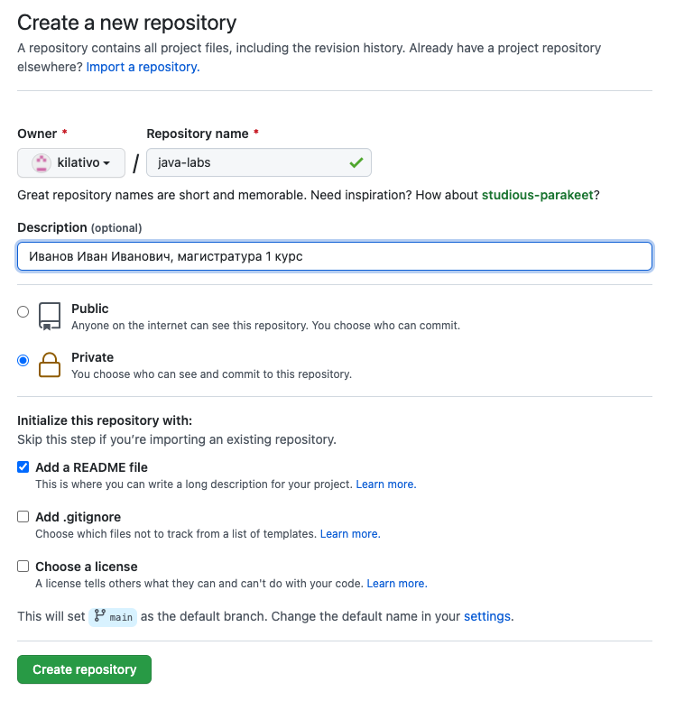
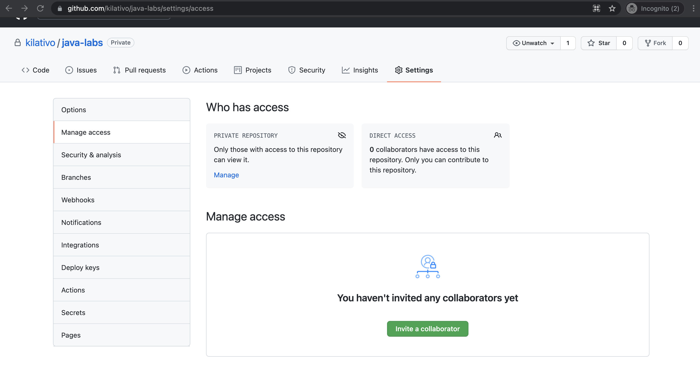
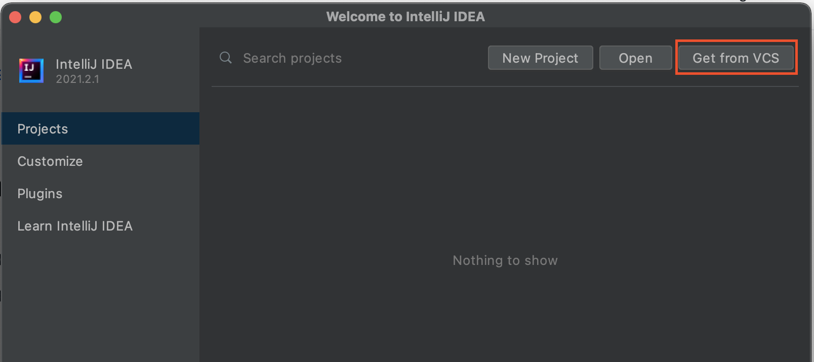
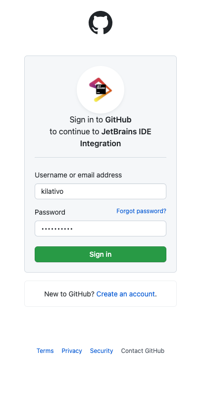
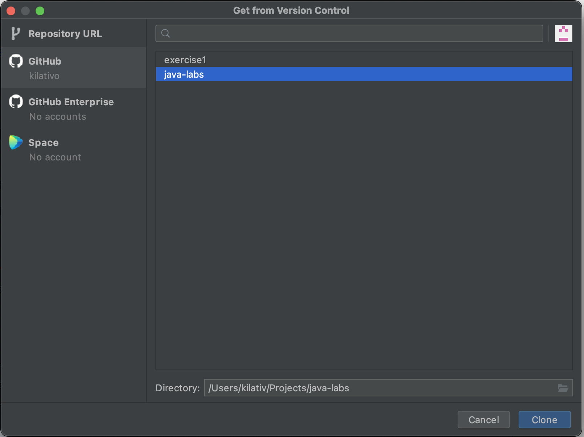
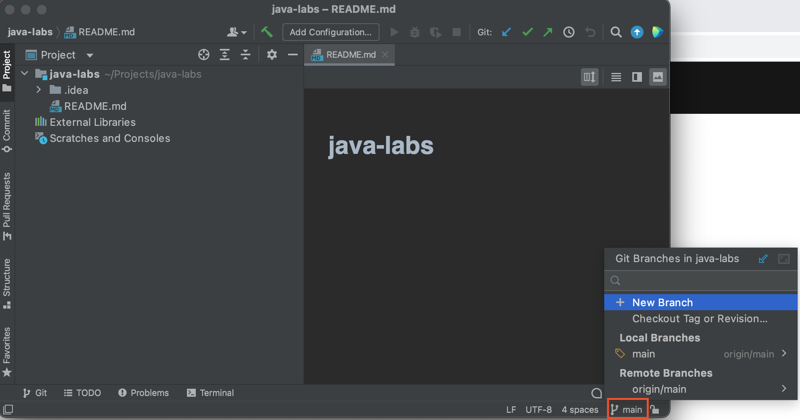
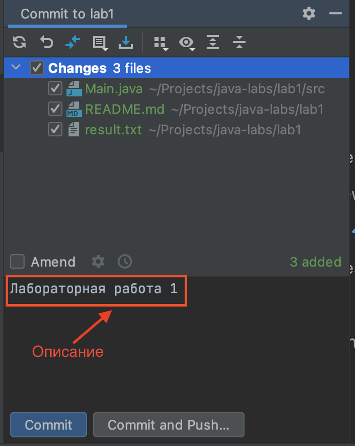
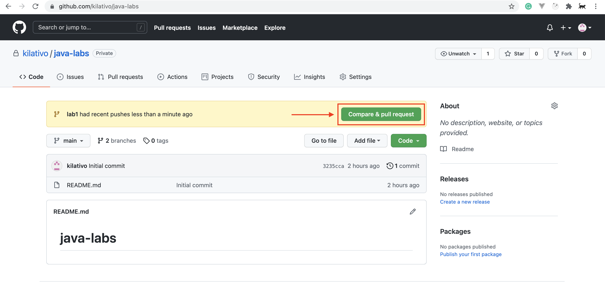
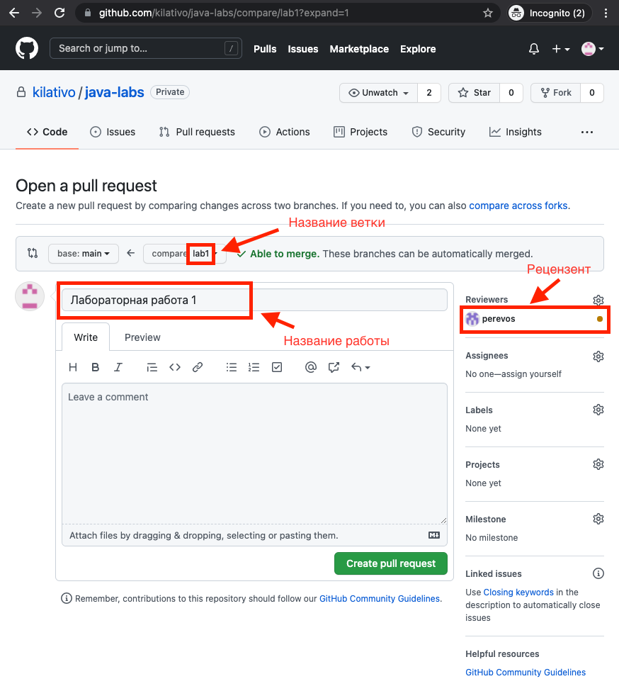

Лабораторные работы по курсу Java сдаются на проверку посредством создания Pull Request на [Github](https://github.com/).

# Регистрация на Github

Если у Вас уже имеется учетная запись на Github, Вы можете воспользоваться ею.
Для создания новой учетной записи перейдите по ссылке https://github.com/signup, введите Ваш адрес электронной почты, уникальное имя пользователя и пароль.

# Создание Git-репозитория для практических работ

Для создания нового репозитория на Github перейдите по ссылке https://github.com/new.
* Введите имя репозитория (например, ```java-exercises``` или ```java-labs```)
* В поле "Description" укажите Ваши фамилию, имя, отчество, курс и специальность.
* Сделайте Ваш репозиторий приватным (Private).
* Нажмите на флажок "Add a README file".

Пример заполнения формы:


# Права доступа для преподавателя

Вам необходимо предоставить преподавателю права доступа к Вашему репозиторию. Это можно сделать следующим образом:

* Перейдите по ссылке https://github.com/<Ваше имя пользователя>/<Имя репозитория>/settings/access. Пример:

* Добавьте преподавателя в соавторы репозитория, нажав на кнопку "Invite a collaborator". В появившемся модальном окне в поле поиска введите ```java-bfu``` и нажмите на кнопку "Select a collaborator above". Далее нажмите на кнопку "Add java-bfu to this repository".

# Клонирование репозитория в IntelliJ IDEA

* Откройте IntelliJ IDEA и выберите "Get from VCS" в правом верхнем углу:

* На левой панели выберите вкладку "GitHub" и нажмите на кнопку "Log In via GitHub".
* Вы будете перенаправлены на веб-страницу Jet Brains. Нажмите на кнопку "Authorize in Github" и далее введите свое имя пользователя на Github и пароль:  

* После успешной авторизации вернитесь в Intellij IDEA, выберите Ваш репозиторий и нажмите "Clone":  


# Создание ветки Git для выполнения практической работы
* Откройте склонированный репозиторий в Intellij IDEA. В правом нижнем углу нажмите на "main" (главной ветки Вашего Git-проекта) и нажмите на "New Branch":  

* В диалоговом окне дайте имя Вашей новой ветке (например, "lab1" для практической работы № 1) и нажмите "Create".
* **Рекомендация**: Для каждой практической работы создавайте новую ветку.

# Создание Pull Request для сдачи работы на проверку
* После выполнения задания создайте Commit с Вашими изменениями. В Intellij IDEA на верхней панели нажмите Git -> Commit...
* Выделите все файлы, которые вы хотите включить в Commit, добавьте сообщение и нажмите "Commit and Push":  
  
* Откройте страницу Вашего репозитория на Github. Вы увидите сообщение о последних изменениях. Нажмите на кнопку "Compare & pull request":
  
* Заполните форму для Pull Request'a. Введите имя для Pull Request'a (например, "Лабораторная работа 1"), а также внесите преподавателя в список рецензентов (Reviewers), как показано на рисунке:
  
* После заполнения формы нажмите на кнопку "Create pull request".

# Дополнительные материалы

* [Введение в Git](https://habr.com/ru/post/472600/)
